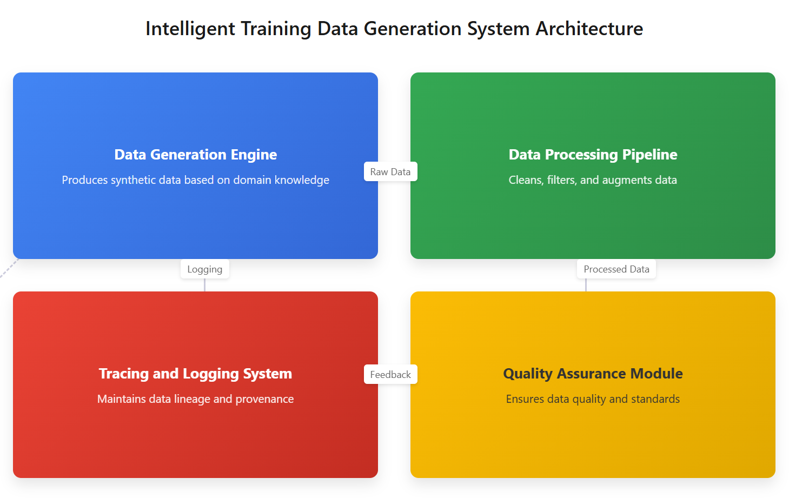

# Design Document: Intelligent Training Data Generation System

## 1. Introduction

This document outlines the design of an automated system for generating and processing high-quality training data for local representation models, specifically focusing on the Qwen 2.5 series. The system addresses the challenges of creating domain-specific datasets in industries where data availability is limited.

## 2. System Architecture



The system consists of four main components:

1. **Data Generation Engine**: Produces synthetic data and response pairs based on domain knowledge
2. **Data Processing Pipeline**: Cleans, filters, and augments the generated data
3. **Quality Assurance Module**: Ensures data quality and adherence to standards
4. **Tracing and Logging System**: Maintains complete data lineage and provenance

## 3. Data Collection Structure

### 3.1 Response Format

All data follows a consistent JSON schema:

```json
{
  "id": "unique_identifier",
  "created_at": "timestamp",
  "domain": "specific_industry_domain",
  "input": "user query or scenario description",
  "response": "model-generated response",
  "metadata": {
    "generation_method": "method_name",
    "generator_version": "version",
    "quality_score": 0.95,
    "review_status": "approved"
  },
  "trace": {
    "parent_id": "id_of_source_data",
    "processing_steps": [
      {"name": "step_name", "timestamp": "time", "params": {}}
    ]
  }
}
```

### 3.2 Required Data Elements

For each industry domain, we collect:
- Domain-specific terminology and jargon
- Common scenarios and use cases
- Expert responses to typical queries
- Business rules and constraints
- Reference documentation

### 3.3 Ensuring Data Diversity and Representativeness

We employ the following strategies:
- **Stratified Sampling**: Balance data across different subdomains
- **Diversity Metrics**: Track and optimize for variety in scenarios, vocabulary, and response styles
- **Adversarial Examples**: Include edge cases and challenging scenarios
- **Demographic Balance**: Ensure data represents diverse user perspectives
- **Active Learning**: Prioritize generation of underrepresented data points

## 4. Task 1: Automated Data Response Pair Generation

### 4.1 Generation Process

1. **Seed Data Collection**: Gather domain knowledge from experts and documentation
2. **Template Creation**: Develop parameterized templates for common scenarios
3. **Diversity Expansion**: Use local representation models to expand templates with variations
4. **Response Generation**: Generate high-quality responses using the base model
5. **Quality Filtering**: Apply quality checks to filter generated pairs
6. **Human Review**: Selectively review samples to ensure quality

### 4.2 Response Management

Each response is:
- Uniquely identified
- Version controlled
- Quality scored
- Tagged with metadata
- Linked to its generation history

## 5. Task 2: Training Dataset Generation Scheme

### 5.1 Dataset Creation Process

1. **Domain Analysis**: Identify key concepts and scenarios in the target domain
2. **Data Planning**: Define target distribution and quality metrics
3. **Synthetic Generation**: Create core dataset using generative techniques
4. **Augmentation**: Expand dataset through controlled transformations
5. **Filtering**: Apply quality and relevance filters
6. **Validation**: Verify dataset against established metrics
7. **Packaging**: Prepare final dataset with appropriate splits and metadata

### 5.2 Traceability Implementation

Every data point includes:
- Origin information
- Complete processing history
- Quality assessment results
- Version information
- Links to derivative data points

This is implemented using a directed acyclic graph (DAG) representation of data lineage.

## 6. Implementation Details

### 6.1 Technologies

- **Python**: Core implementation language
- **Qwen 2.5**: Base model for generation and evaluation
- **LangChain**: Framework for chaining generation processes
- **SQLite/PostgreSQL**: Data storage and retrieval
- **Ray**: Distributed processing for large-scale generation
- **MLflow**: Experiment tracking and model management
- **FastAPI**: API for data generation services

### 6.2 Quality Control Measures

- Automated quality scoring using heuristics and model-based evaluation
- Consistency checking across related data points
- Periodic human review of samples
- Feedback loop to improve generation quality

### 6.3 Scalability Considerations

- Horizontally scalable architecture for data generation
- Efficient storage and indexing for large datasets
- Modular design to facilitate adding new domains or generation methods

## 7. Multilingual Support

The system supports multiple languages through:
- Language-specific templates and rules
- Cross-lingual generation techniques
- Language detection and validation
- Translation quality assessment

## 8. Verification Method

We verify the effectiveness of our generated data by:
1. Fine-tuning a small Qwen 2.5 model on the generated dataset
2. Evaluating performance on a held-out test set
3. Comparing against a baseline model trained on standard data
4. Analyzing model behavior on domain-specific tasks

## 9. Future Extensions

- Integration with active learning systems
- Support for multimodal data generation
- Enhanced privacy-preserving techniques
- Automated discovery of domain-specific patterns
